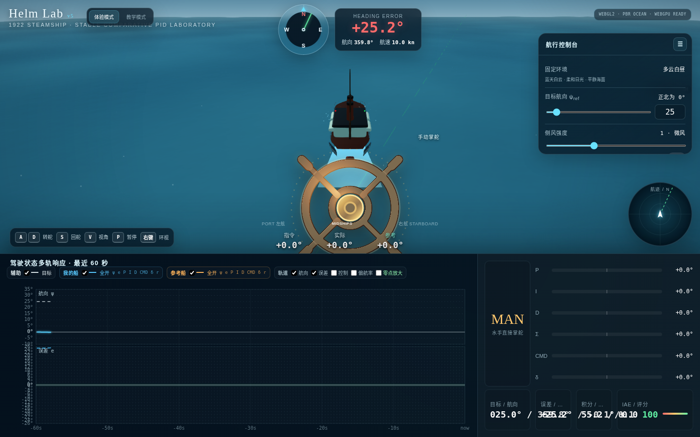
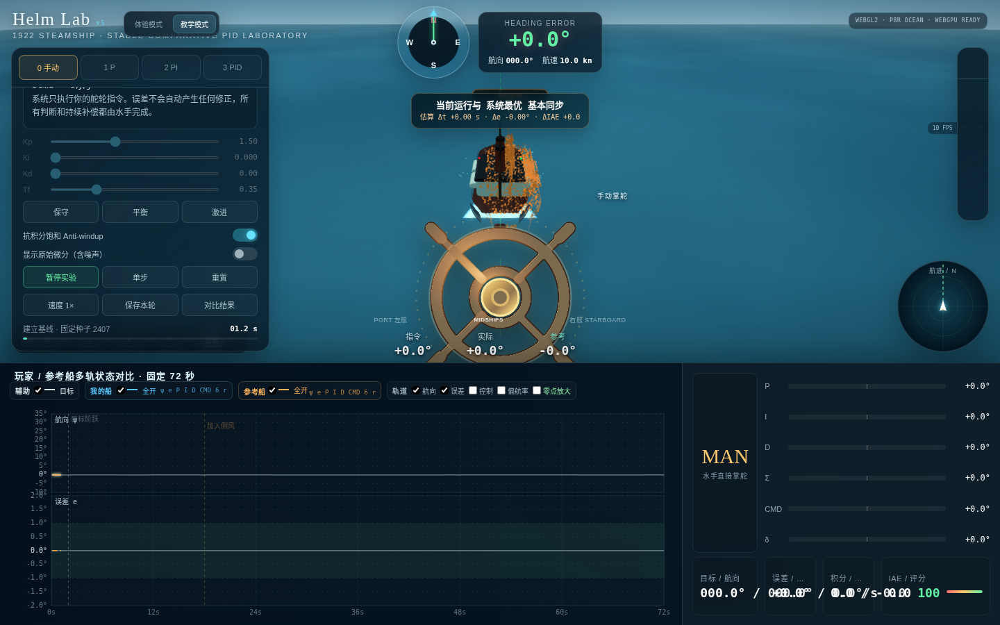

# 船舵控制与 PID 控制教学模拟器

本项目主题：使用船舵控制轮船，感受人工控制过程，并进一步感受 PID 控制如何改善航向保持。

重要说明：本仓库中的内容均由 AI 进行 Coding 生成，包括需求文本、HTML/CSS/JavaScript 实现和交互逻辑。

## 模式介绍

### 体验模式 Experience

体验模式用于让用户完全手动掌舵，重点感受船舵输入、舵机延迟、船体惯性、航向误差和航迹变化之间的关系。该模式默认关闭 PID 自动控制，用户通过船舵、键盘或触控直接控制轮船，并在平静海面、固定多云白昼环境中观察船体响应。

该模式适合先建立控制直觉：船不会在转舵后立刻改变航向，回舵后也会因偏航惯性继续转动。通过自由航行、阵风和横流等场景，可以直观看到人工控制需要持续观察误差、提前修正和适时回舵。



### 教学模式 Tutorial

教学模式按照 Manual → P → PI → PID 的顺序组织课程，使用相同初始状态、目标航向、固定扰动种子和侧风条件进行可重复实验。用户可以调节 PID 参数，暂停、继续、单步运行实验，并保存不同阶段结果进行曲线叠加和指标对比。

该模式同时显示玩家船与参考 PID 船。参考船使用推荐参数或记录伪影，在同一时间轴下与玩家船并行运行。底部状态图以蓝青色系展示玩家船变量，以橙金色系展示参考船变量，便于比较航向、误差、P/I/D 输出、舵角和偏航率的差异。



## 使用方式

直接打开 `index.html`，或在项目目录启动一个本地静态服务器：

```bash
python3 -m http.server 8000
```

然后访问 `http://localhost:8000/`。

## 内容

- `index.html`：独立网页教学工具。
- `docs/experience-mode.png`：体验模式 HTML 截图。
- `docs/tutorial-mode.png`：教学模式 HTML 截图。
- `Claude_For_Request_v5.txt`：当前版本需求说明。
- `Claude_For_Request_v1.txt` 至 `Claude_For_Request_v4.txt`：历史需求版本。
- `Request_Prompt.txt` 和 `Claude_For_Request.txt`：初始需求文本。
